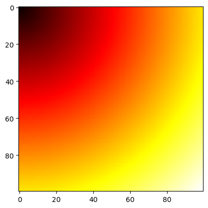
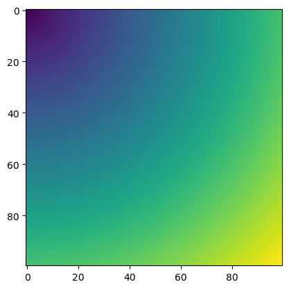
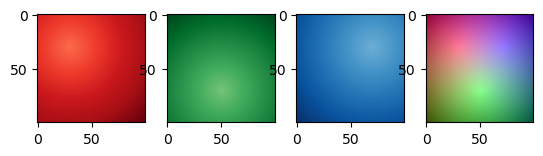
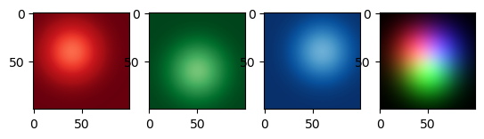
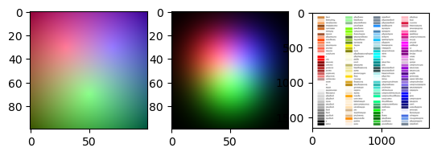

# Goodsy Magic Python Library - A Reference

Note - all required modules for this library have been installed on the `py10kernel` kernel.  If you use a different kernel you may have some installing to do.


```python
import sys
import subprocess

goodies_dir = '/Path/To/Goodies/Repo/'
goodies_dir = subprocess.check_output(['pwd']).decode().replace('goodsy_python\n','')

sys.path.append(goodies_dir)

from goodsy_python import magic as gm
```

---
## General

### string2hash

Creates an sha1 hash of a string. Useful for lots of things, such as row-uniqueness.


```python
gm.string2hash('some string here')
```


    'f0e503de1e559646264ac51543238314cbb6d0f8'


### wget

Can do a dummy-run with `go=False` to check the wget string before doing anything.
Default is with `go=True`


```python
my_url = 'https://raw.githubusercontent.com/paul-goodall/Goodies/refs/heads/main/goodsy_python/useful/css_colours.png'
output_file = 'data/test.png'
gm.wget(url = my_url, filename = output_file, go=False)
```


    'wget -q -O data/test.png "https://raw.githubusercontent.com/paul-goodall/Goodies/refs/heads/main/goodsy_python/useful/css_colours.png"'


```python
gm.wget(url = my_url, filename = output_file)
```


    'wget -q -O data/test.png "https://raw.githubusercontent.com/paul-goodall/Goodies/refs/heads/main/goodsy_python/useful/css_colours.png"'


``


### linux_fastcombine_csvs


```python
gm.linux_fastcombine_csvs('csvs/*.csv', 'csvs/file_001.csv', 'combined.csv', go=False)
```


        ulimit -n 2048;
        head -n 1 csvs/file_001.csv > combined.csv;
        tail -n +2 -q csvs/*.csv >> combined.csv;


---
## Dates

### date_info_df

This function can be called on a single date-like string or on a pandas series:


```python
gm.date_info_df('2025-02-04')
```


<div>
<style scoped>
    .dataframe tbody tr th:only-of-type {
        vertical-align: middle;
    }

    .dataframe tbody tr th {
        vertical-align: top;
    }

    .dataframe thead th {
        text-align: right;
    }
</style>
<table border="1" class="dataframe">
  <thead>
    <tr style="text-align: right;">
      <th></th>
      <th>Date_Orig</th>
      <th>WeekDay</th>
      <th>Year</th>
      <th>Month</th>
      <th>DayOfMonth</th>
      <th>DOM</th>
      <th>DayOfYear</th>
      <th>DOY</th>
      <th>DaysInYear</th>
      <th>NumericDate</th>
      <th>DayName_1stJan</th>
      <th>WeekOfYear</th>
      <th>WOY</th>
    </tr>
  </thead>
  <tbody>
    <tr>
      <th>0</th>
      <td>2025-02-04</td>
      <td>Tuesday</td>
      <td>2025</td>
      <td>2</td>
      <td>4</td>
      <td>4</td>
      <td>35</td>
      <td>35</td>
      <td>365</td>
      <td>2025.094521</td>
      <td>Wednesday</td>
      <td>6</td>
      <td>6</td>
    </tr>
  </tbody>
</table>
</div>


```python
import pandas as pd

df = pd.DataFrame({'Dt':['2021-02-03','2022-03-04','2023-04-05','2024-05-06']}, index=[0,1,2,3])
df
```


<div>
<style scoped>
    .dataframe tbody tr th:only-of-type {
        vertical-align: middle;
    }

    .dataframe tbody tr th {
        vertical-align: top;
    }

    .dataframe thead th {
        text-align: right;
    }
</style>
<table border="1" class="dataframe">
  <thead>
    <tr style="text-align: right;">
      <th></th>
      <th>Dt</th>
    </tr>
  </thead>
  <tbody>
    <tr>
      <th>0</th>
      <td>2021-02-03</td>
    </tr>
    <tr>
      <th>1</th>
      <td>2022-03-04</td>
    </tr>
    <tr>
      <th>2</th>
      <td>2023-04-05</td>
    </tr>
    <tr>
      <th>3</th>
      <td>2024-05-06</td>
    </tr>
  </tbody>
</table>
</div>


```python
df_dates = gm.date_info_df(df['Dt'])
df_dates
```


<div>
<style scoped>
    .dataframe tbody tr th:only-of-type {
        vertical-align: middle;
    }

    .dataframe tbody tr th {
        vertical-align: top;
    }

    .dataframe thead th {
        text-align: right;
    }
</style>
<table border="1" class="dataframe">
  <thead>
    <tr style="text-align: right;">
      <th></th>
      <th>Date_Orig</th>
      <th>WeekDay</th>
      <th>Year</th>
      <th>Month</th>
      <th>DayOfMonth</th>
      <th>DOM</th>
      <th>DayOfYear</th>
      <th>DOY</th>
      <th>DaysInYear</th>
      <th>NumericDate</th>
      <th>DayName_1stJan</th>
      <th>WeekOfYear</th>
      <th>WOY</th>
    </tr>
  </thead>
  <tbody>
    <tr>
      <th>0</th>
      <td>2021-02-03</td>
      <td>Wednesday</td>
      <td>2021</td>
      <td>2</td>
      <td>3</td>
      <td>3</td>
      <td>34</td>
      <td>34</td>
      <td>365</td>
      <td>2021.091781</td>
      <td>Friday</td>
      <td>6</td>
      <td>6</td>
    </tr>
    <tr>
      <th>1</th>
      <td>2022-03-04</td>
      <td>Friday</td>
      <td>2022</td>
      <td>3</td>
      <td>4</td>
      <td>4</td>
      <td>63</td>
      <td>63</td>
      <td>365</td>
      <td>2022.171233</td>
      <td>Saturday</td>
      <td>10</td>
      <td>10</td>
    </tr>
    <tr>
      <th>2</th>
      <td>2023-04-05</td>
      <td>Wednesday</td>
      <td>2023</td>
      <td>4</td>
      <td>5</td>
      <td>5</td>
      <td>95</td>
      <td>95</td>
      <td>365</td>
      <td>2023.258904</td>
      <td>Sunday</td>
      <td>15</td>
      <td>15</td>
    </tr>
    <tr>
      <th>3</th>
      <td>2024-05-06</td>
      <td>Monday</td>
      <td>2024</td>
      <td>5</td>
      <td>6</td>
      <td>6</td>
      <td>127</td>
      <td>127</td>
      <td>366</td>
      <td>2024.345628</td>
      <td>Monday</td>
      <td>19</td>
      <td>19</td>
    </tr>
  </tbody>
</table>
</div>


---
## IO - Input / Output


```python
gm.mkdir('data/')
```


```python
gm.glob_files('README*')
```


    ['README.ipynb', 'README.md']


```python
txt = f'''
Here is a silly paragraph.
Unfortunately, it doesn't really tell us anything useful.
'''

gm.wTXT(txt, 'data/silly.txt')
```


```python
tmp = gm.rTXT('data/silly.txt')

tmp
```


    "\nHere is a silly paragraph.\nUnfortunately, it doesn't really tell us anything useful.\n\n"


```python
dct = {'A':'Apple','B':'Banana','C':'Cranberry'}


jsn = gm.dict2json(dct)
jsn
```


    '{\n    "A": "Apple",\n    "B": "Banana",\n    "C": "Cranberry"\n}'


```python
gm.wJSON(jsn, 'data/test.json')
```


```python
jdata = gm.rJSON('data/test.json')

jdata
```


    {'A': 'Apple', 'B': 'Banana', 'C': 'Cranberry'}


```python
import seaborn as sns
iris = sns.load_dataset('iris')

obj = {}
obj['txt'] = txt
obj['jsn'] = jsn
obj['jdata'] = jdata
obj['df_dates'] = df_dates
obj['iris'] = iris

gm.wPKL(obj, 'data/raw.pkl')
gm.wPKL(obj, 'data/compressed.pkl.pbz2')
```


```python
res1 = gm.rPKL('data/raw.pkl')

print(res1.keys())

res1['iris'].head()
```

    dict_keys(['txt', 'jsn', 'jdata', 'df_dates', 'iris'])


<div>
<style scoped>
    .dataframe tbody tr th:only-of-type {
        vertical-align: middle;
    }

    .dataframe tbody tr th {
        vertical-align: top;
    }

    .dataframe thead th {
        text-align: right;
    }
</style>
<table border="1" class="dataframe">
  <thead>
    <tr style="text-align: right;">
      <th></th>
      <th>sepal_length</th>
      <th>sepal_width</th>
      <th>petal_length</th>
      <th>petal_width</th>
      <th>species</th>
    </tr>
  </thead>
  <tbody>
    <tr>
      <th>0</th>
      <td>5.1</td>
      <td>3.5</td>
      <td>1.4</td>
      <td>0.2</td>
      <td>setosa</td>
    </tr>
    <tr>
      <th>1</th>
      <td>4.9</td>
      <td>3.0</td>
      <td>1.4</td>
      <td>0.2</td>
      <td>setosa</td>
    </tr>
    <tr>
      <th>2</th>
      <td>4.7</td>
      <td>3.2</td>
      <td>1.3</td>
      <td>0.2</td>
      <td>setosa</td>
    </tr>
    <tr>
      <th>3</th>
      <td>4.6</td>
      <td>3.1</td>
      <td>1.5</td>
      <td>0.2</td>
      <td>setosa</td>
    </tr>
    <tr>
      <th>4</th>
      <td>5.0</td>
      <td>3.6</td>
      <td>1.4</td>
      <td>0.2</td>
      <td>setosa</td>
    </tr>
  </tbody>
</table>
</div>


```python
res2 = gm.rPKL('data/compressed.pkl.pbz2')

print(res2.keys())

res2['iris'].head()
```

    dict_keys(['txt', 'jsn', 'jdata', 'df_dates', 'iris'])


<div>
<style scoped>
    .dataframe tbody tr th:only-of-type {
        vertical-align: middle;
    }

    .dataframe tbody tr th {
        vertical-align: top;
    }

    .dataframe thead th {
        text-align: right;
    }
</style>
<table border="1" class="dataframe">
  <thead>
    <tr style="text-align: right;">
      <th></th>
      <th>sepal_length</th>
      <th>sepal_width</th>
      <th>petal_length</th>
      <th>petal_width</th>
      <th>species</th>
    </tr>
  </thead>
  <tbody>
    <tr>
      <th>0</th>
      <td>5.1</td>
      <td>3.5</td>
      <td>1.4</td>
      <td>0.2</td>
      <td>setosa</td>
    </tr>
    <tr>
      <th>1</th>
      <td>4.9</td>
      <td>3.0</td>
      <td>1.4</td>
      <td>0.2</td>
      <td>setosa</td>
    </tr>
    <tr>
      <th>2</th>
      <td>4.7</td>
      <td>3.2</td>
      <td>1.3</td>
      <td>0.2</td>
      <td>setosa</td>
    </tr>
    <tr>
      <th>3</th>
      <td>4.6</td>
      <td>3.1</td>
      <td>1.5</td>
      <td>0.2</td>
      <td>setosa</td>
    </tr>
    <tr>
      <th>4</th>
      <td>5.0</td>
      <td>3.6</td>
      <td>1.4</td>
      <td>0.2</td>
      <td>setosa</td>
    </tr>
  </tbody>
</table>
</div>


```python
wb = {}
wb['sheet1'] = df_dates
wb['iris'] = iris

gm.wXL(wb, 'data/excel.xlsx')
```

    data/excel.xlsx


```python
new_wb = gm.rXL('data/excel.xlsx')

new_wb['iris'].head()
```


<div>
<style scoped>
    .dataframe tbody tr th:only-of-type {
        vertical-align: middle;
    }

    .dataframe tbody tr th {
        vertical-align: top;
    }

    .dataframe thead th {
        text-align: right;
    }
</style>
<table border="1" class="dataframe">
  <thead>
    <tr style="text-align: right;">
      <th></th>
      <th>sepal_length</th>
      <th>sepal_width</th>
      <th>petal_length</th>
      <th>petal_width</th>
      <th>species</th>
    </tr>
  </thead>
  <tbody>
    <tr>
      <th>0</th>
      <td>5.1</td>
      <td>3.5</td>
      <td>1.4</td>
      <td>0.2</td>
      <td>setosa</td>
    </tr>
    <tr>
      <th>1</th>
      <td>4.9</td>
      <td>3.0</td>
      <td>1.4</td>
      <td>0.2</td>
      <td>setosa</td>
    </tr>
    <tr>
      <th>2</th>
      <td>4.7</td>
      <td>3.2</td>
      <td>1.3</td>
      <td>0.2</td>
      <td>setosa</td>
    </tr>
    <tr>
      <th>3</th>
      <td>4.6</td>
      <td>3.1</td>
      <td>1.5</td>
      <td>0.2</td>
      <td>setosa</td>
    </tr>
    <tr>
      <th>4</th>
      <td>5.0</td>
      <td>3.6</td>
      <td>1.4</td>
      <td>0.2</td>
      <td>setosa</td>
    </tr>
  </tbody>
</table>
</div>


```python
data1 = gm.rvals(100,100)

gm.wFITS(data1, 'data/rvals.fits')

gm.plt.imshow(data1, cmap='hot')
gm.plt.show()
```





```python
data2, hdr = gm.rFITS('data/rvals.fits')

print(data2.shape)
print(hdr)

gm.plt.imshow(data2)
gm.plt.show()
```

    (100, 100)
    SIMPLE  =                    T / conforms to FITS standard                      BITPIX  =                  -64 / array data type                                NAXIS   =                    2 / number of array dimensions                     NAXIS1  =                  100                                                  NAXIS2  =                  100                                                  EXTEND  =                    T                                                  END                                                                                                                                                                                                                                                                                                                                                                                                                                                                                                                                                                                                                                                                                                                                                                                                                                                                                                                                                                                                                                                                                                                                                                                                                                                                                                                                                                                                                                                                                                                                                                                                                                                                                                                                                                                                                                                                                                                                                                                                                                                                                                                                                                                                                                                                                                                                                                                                                                                                                             





```python
rr = gm.rvals(nx=100,ny=100,x0=30,y0=30,norm=True)
rr = 1. - rr
gg = gm.rvals(nx=100,ny=100,x0=50,y0=70,norm=True)
gg = 1. - gg
bb = gm.rvals(nx=100,ny=100,x0=70,y0=30,norm=True)
bb = 1. - bb

im = gm.np.arange(100*100*3).reshape([100,100,3]) * 0.0
im[:,:,0] = rr
im[:,:,1] = gg
im[:,:,2] = bb

fig, ax = gm.plt.subplots(1, 4)
ax[0].imshow(rr, cmap=gm.blackred)
ax[1].imshow(gg, cmap=gm.blackgreen)
ax[2].imshow(bb, cmap=gm.blackblue)
ax[3].imshow(im)
gm.plt.show()
```





```python
gm.wIMG(im, 'data/rgb1.png')
```

``


```python
nx = 100
ny = 100

xx = gm.xvals(nx,ny)
yy = gm.yvals(nx,ny)
xy = xx,yy

sigma = 20
rr = gm.Gaussian2D(xy, 40, 40, 1, sigma, 0).reshape([nx,ny])
gg = gm.Gaussian2D(xy, 50, 60, 1, sigma, 0).reshape([nx,ny])
bb = gm.Gaussian2D(xy, 60, 40, 1, sigma, 0).reshape([nx,ny])

im = gm.np.arange(100*100*3).reshape([100,100,3]) * 0.0
im[:,:,0] = rr
im[:,:,1] = gg
im[:,:,2] = bb

fig, ax = gm.plt.subplots(1, 4)
ax[0].imshow(rr, cmap=gm.blackred)
ax[1].imshow(gg, cmap=gm.blackgreen)
ax[2].imshow(bb, cmap=gm.blackblue)
ax[3].imshow(im)
gm.plt.show()
```





```python
gm.wIMG(im, 'data/rgb2.png')
```

``


#### NOTE - Matplot plots images from the TOP-RIGHT corner contrary to common sense


```python
im1 = gm.rIMG('data/rgb1.png')
im2 = gm.rIMG('data/rgb2.png')
im3 = gm.rIMG('data/test.png')

fig, ax = gm.plt.subplots(1, 3)
ax[0].imshow(im1)
ax[1].imshow(im2)
ax[2].imshow(im3)
gm.plt.show()
```





```python
gm.df2html(df_dates, 'data/test.html', my_page_title='Table of Dates that is string searchable')
```


```python
from IPython.display import IFrame

IFrame(src='./data/test.html', width=1000, height=500)
```


<iframe
    width="1000"
    height="500"
    src="./data/test.html"
    frameborder="0"
    allowfullscreen

></iframe>


```python
gm.os.system('du -sch data/*')
```

    4.0K	data/compressed.pkl.pbz2
     12K	data/excel.xlsx
    8.0K	data/raw.pkl
     48K	data/rgb1.png
     52K	data/rgb2.png
     84K	data/rvals.fits
    4.0K	data/silly.txt
    4.0K	data/test.html
    4.0K	data/test.json
    400K	data/test.png
    620K	total


    0


```python


```


```python

```


```python

```
